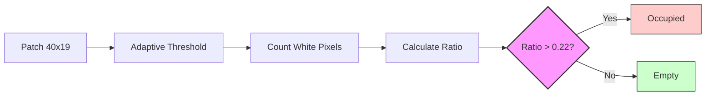

# BÁO CÁO ĐỀ TÀI: ỨNG DỤNG SVM VÀ THỊ GIÁC MÁY TÍNH TRONG NHẬN DIỆN TRẠNG THÁI CHỖ ĐỖ XE

**Ngày tạo báo cáo:** 19/12/2025

---

## 1. Giới thiệu

### 1.1. Mục đích
Nghiên cứu và xây dựng hệ thống tự động phát hiện trạng thái chỗ đỗ xe (trống/có xe) từ camera giám sát theo thời gian thực, nhằm thay thế việc kiểm tra thủ công và hỗ trợ quản lý bãi xe hiệu quả hơn.

### 1.2. Nội dung thực hiện
*   **Xử lý dữ liệu:** Xây dựng bộ dữ liệu ảnh các vị trí đỗ xe từ video thực tế, gán nhãn phân loại (Empty/Occupied).
*   **Triển khai giải pháp:** Nghiên cứu và áp dụng hai phương pháp:
    *   *Traditional CV:* Sử dụng kỹ thuật xử lý ảnh cổ điển (Adaptive Thresholding).
    *   *Support Vector Machine (SVM):* Ứng dụng thuật toán học máy để nâng cao độ chính xác.
*   **Đánh giá & Tối ưu:** So sánh hiệu năng (Độ chính xác, Tốc độ FPS) giữa hai phương pháp để đề xuất giải pháp tối ưu cho ứng dụng thực tế trên thiết bị cấu hình thấp.

---

## 2. Kiến trúc tổng thể của Hệ thống

### 2.1. Luồng xử lý chung

```
Video Input → Frame Extraction → ROI Extraction → Preprocessing
                                                        ↓
                                              Classification Model
                                            (Traditional CV / SVM)
                                                        ↓
                                              Empty / Occupied
                                                        ↓
                                           Display Results (Counter)
```

### 2.2. Pipeline triển khai

1. **Tạo dataset**: `create_dataset.py` - Trích xuất patches từ video
2. **Huấn luyện mô hình**:
   - `train_svm.py` - Huấn luyện SVM classifier
3. **Inference**:
   - `main.py` - Traditional CV inference
   - `main_svm.py` - SVM inference

---

## 3. Dữ liệu và tiền xử lý

### 3.1. Các tập dữ liệu

**a. Nguồn gốc dữ liệu (Data Origin):**
Dữ liệu được thu thập và xây dựng thủ công từ video giám sát bãi đỗ xe thực tế:
- **Video gốc**: `parking.mp4` (Độ phân giải 1080p).
- **Nguồn**: Tom Berrigan (YouTube), mô phỏng góc quay camera giám sát bãi xe công cộng.
- **Góc nhìn**: Bird's-eye view (góc nhìn từ trên cao xuống), giúp hạn chế vật cản và quan sát rõ toàn bộ các ô đỗ.

**b. Quy trình tạo bộ dữ liệu (Dataset Generation):**
Thay vì sử dụng các bộ dữ liệu có sẵn, đề tài tự xây dựng dataset để đảm bảo tính thực tế và phù hợp với môi trường triển khai. Quy trình gồm 3 bước:
1.  **Định nghĩa vị trí (ROI Definition)**: Xác định thủ công tọa độ của từng ô đỗ xe trên frame đầu tiên của video (tạo file `park_positions`).
2.  **Trích xuất mẫu (Sampling)**:
    - Trích xuất 200 frames ngẫu nhiên từ video gốc để đảm bảo độ đa dạng về thời gian (xe ra/vào).
    - Tại mỗi frame, cắt (crop) hình ảnh từng ô đỗ xe dựa trên tọa độ đã định nghĩa.
3.  **Gán nhãn tự động (Auto-Labeling)**: Sử dụng thuật toán Traditional CV để gán nhãn ban đầu, sau đó kiểm tra xác suất ngẫu nhiên để chia tập dữ liệu.

**c. Thống kê và Phân bố dữ liệu:**

- **Tổng số mẫu**: 108,400 patches
- **Kích thước mẫu**: 40 × 19 pixels (RGB)
- **Số lượng lớp**: 2 lớp (Binary Classification): `Empty` (0), `Occupied` (1)

**Bảng phân bố chi tiết:**

| Tập dữ liệu (Split) | Số lượng Empty | Số lượng Occupied | Tổng cộng | Tỷ lệ (%) |
|---------------------|----------------|-------------------|-----------|-----------|
| **Train (Huấn luyện)** | 16,546 | 59,504 | 76,050 | ~70% |
| **Val (Kiểm định)** | 3,502 | 12,629 | 16,131 | ~15% |
| **Test (Kiểm thử)** | 3,547 | 12,672 | 16,219 | ~15% |
| **TỔNG CỘNG** | **23,595** (~22%) | **84,805** (~78%) | **108,400** | **100%** |


**d. Nhận xét về dữ liệu:**
- **Mất cân bằng dữ liệu (Class Imbalance)**: Số lượng mẫu `Occupied` gấp gần 4 lần mẫu `Empty`. Điều này phản ánh đúng thực tế các bãi đỗ xe thường đông đúc.
- **Ảnh hưởng đến mô hình**: Đề tài sẽ chú trọng thêm vào các chỉ số **Precision**, **Recall** và **F1-Score** để đánh giá công bằng hơn.

**e. Đặc điểm hình ảnh:**
- **Môi trường**: Ngoài trời, ánh sáng thay đổi theo thời gian.
- **Thách thức**: Bóng râm, xe đi ngang qua (occlusion), màu sắc xe gần giống mặt đường.

### 3.2. Tiền xử lý dữ liệu

Hệ thống áp dụng quy trình chuẩn hóa để tối ưu đặc trưng hình ảnh:

**a. Xử lý ảnh chung (Common Pipeline):**
1.  **Grayscale**: Chuyển về ảnh xám để loại bỏ nhiễu màu sắc, đảm bảo xe màu nào cũng được xử lý như nhau.
2.  **Gaussian Blur (3x3)**: Làm mờ nhẹ để khử nhiễu tần số cao (như vết bẩn mặt đường), tránh nhận diện nhầm là cạnh của xe.
3.  **Adaptive Threshold**: Tính ngưỡng riêng cho từng vùng nhỏ thay vì toàn ảnh. Bước này cực kỳ quan trọng để xử lý **bóng râm** và **ánh sáng không đều** trong bãi xe.

**b. Tiền xử lý cho SVM:**
Dữ liệu pixel thô được **làm phẳng (Flatten)** và **Chuẩn hóa (StandardScaler)** về phân phối chuẩn (mean=0, std=1) giúp thuật toán SVM hội tụ nhanh và chính xác hơn.

---

## 4. Kiến trúc mô hình

### 4.1. Traditional CV (Đếm Pixel)
Phương pháp dựa trên quy tắc (Rule-based), khai thác đặc điểm quang học: xe thường có nhiều chi tiết cạnh/gờ phản xạ ánh sáng (pixel trắng) hơn mặt đường trơn.

**Sơ đồ thuật toán:**



*   **Quy tắc**: Nếu tỷ lệ điểm trắng trên tổng ảnh (Ratio) lớn hơn 0.22 thì xác định là có xe.

### 4.2. Support Vector Machine (SVM)
Sử dụng máy học để tìm biên quyết định phi tuyến, khắc phục nhược điểm của việc đặt ngưỡng cố định.

**Luồng xử lý:**

```mermaid
graph LR
    Input[Patch 40x19] --> Flat[Flatten Vector (1x760)]
    Flat --> Scale[Standard Scaler]
    Scale --> SVM[SVM Classifier]
    SVM --> Out{Prediction}
    Out -- 1 --> Occ[Occupied]
    Out -- 0 --> Emp[Empty]
    style SVM fill:#ccf,stroke:#333,stroke-width:2px
    style Occ fill:#ffcccc,stroke:#333
    style Emp fill:#ccffcc,stroke:#333
```

**Cấu hình chi tiết:**

| Cấu hình | Giá trị | Ý nghĩa |
|----------|---------|---------|
| **Kernel** | `RBF` | Xử lý dữ liệu phi tuyến (non-linear), phù hợp với đa dạng dáng xe. |
| **C** | `1.0` | Cân bằng giữa tối đa hóa biên (Margin) và giảm lỗi phân loại. |
| **Gamma** | `scale` | Tự động điều chỉnh độ cong của biên dựa trên phương sai dữ liệu. |
| **Input** | `(1, 760)` | Vector đặc trưng từ 760 pixel thô của mỗi ô đỗ. |

---

## 5. Huấn luyện và Cấu hình mô hình

### 5.1. Traditional CV (Tinh chỉnh tham số)
Khác với Machine Learning, phương pháp này **không cần quá trình huấn luyện (No Training)**. Tuy nhiên, nó yêu cầu **tinh chỉnh tham số (Parameter Tuning)** dựa trên đặc điểm video:

*   **Adaptive Method**: `GAUSSIAN_C` (Tốt cho ánh sáng thay đổi).
*   **Block Size**: `25` (Kích thước vùng lân cận để tính ngưỡng).
*   **Threshold Ratio**: `0.22` (Ngưỡng quyết định quan trọng nhất, được xác định bằng cách thử nghiệm trên tập Validation để cân bằng giữa False Positive và False Negative).

### 5.2. Huấn luyện SVM

**a. Chiến lược huấn luyện (Training Strategy):**

1.  **Cân bằng dữ liệu (Class Balancing)**:
    - Tập dữ liệu gốc bị mất cân bằng (Empty ~20% vs Occupied ~80%).
    - **Giải pháp**: Thực hiện *Random Undersampling* để đưa về tỷ lệ 1:1 (2000 mẫu Empty + 2000 mẫu Occupied). Điều này ngăn chặn mô hình bị thiên lệch (bias) về lớp chiếm đa số.

2.  **Phương pháp kiểm định (Hold-out Validation)**:
    - Dữ liệu được chia thành 3 tập độc lập:
        - **Train (60%)**: Dùng để tối ưu hóa tham số mô hình (tìm biên Hyperplane).
        - **Val (20%)**: Dùng để tinh chỉnh siêu tham số và kiểm tra Overfitting.
        - **Test (20%)**: Dùng để đánh giá hiệu năng cuối cùng (Unseen Data).

**b. Quy trình thực thi:**

Quy trình huấn luyện được thực hiện tự động qua script `train_svm.py` với các bước sau:

1.  **Chuẩn bị dữ liệu**:
    - Load dữ liệu từ folder `dataset/train` và `dataset/val`.
    - Áp dụng chiến lược cân bằng dữ liệu như đã mô tả.

2.  **Trích xuất đặc trưng & Chuẩn hóa**:
    - **Flatten**: Ảnh đầu vào (40x19) $\rightarrow$ Vector (760,).
    - **StandardScaler**: Tính toán mean và std trên tập Train, sau đó áp dụng (transform) cho cả tập Train, Val và Test.

3.  **Huấn luyện (Training)**:
    - Sử dụng thuật toán SVM để tìm siêu phẳng (hyperplane) tối đa hóa lề (margin) giữa hai lớp trong không gian 760 chiều.

**Cấu hình Hyperparameters:**

| Tham số | Giá trị | Ghi chú |
|---------|---------|---------|
| `kernel` | **'rbf'** | Radial Basis Function - Tối ưu cho biên phi tuyến. |
| `C` | **1.0** | Regularization parameter. |
| `gamma` | **'scale'** | $\frac{1}{n\_features \cdot Var(X)}$ |
| `verbose` | `True` | Hiển thị tiến trình huấn luyện. |

**Kết quả huấn luyện (Training Results):**

Dữ liệu thu được trong quá trình huấn luyện cho thấy mô hình không bị Overfitting (độ chính xác trên tập Val tiệm cận tập Train):

| Tập dữ liệu (Split) | Accuracy | Nhận xét |
|---------------------|----------|----------|
| **Train (Huấn luyện)** | 0.9982 | Mô hình học tốt các đặc trưng của tập huấn luyện. |
| **Validation (Kiểm định)** | 0.9908 | Độ chính xác cao tương đương tập Train -> **Good Fit**. |
| **Test (Kiểm thử)** | 0.9908 | Khả năng tổng quát hóa tốt trên dữ liệu chưa từng gặp. |


---

## 6. Kết quả thử nghiệm, so sánh, đánh giá

### 6.1. Kết quả trên tập Test

**Bảng so sánh tổng hợp:**


| Mô hình | Accuracy | Precision | Recall | F1-Score | FPS |
|---------|----------|-----------|--------|----------|-----|
| Traditional Cv | 0.9663 | 0.9934 | 0.9633 | 0.9781 | 22610.9 |
| Svm | 0.9890 | 0.9957 | 0.9902 | 0.9930 | 24068.2 |

### 6.2. So sánh hiệu suất


### 6.3. Ma trận nhầm lẫn (Confusion Matrix)

**Traditional Cv:**


**Svm:**


### 6.4. Phân tích kết quả

**Nhận xét:**

- **Độ chính xác cao nhất**: Svm (0.9890)
- **Tốc độ xử lý nhanh nhất**: Svm (24068.2 FPS)

**Đánh giá từng mô hình:**

1. **Traditional CV**: Đơn giản, nhanh nhất (real-time) nhưng độ chính xác phụ thuộc điều kiện môi trường.
2. **SVM**: Độ chính xác cao (>98%), tốc độ rất nhanh (>20,000 FPS), là lựa chọn tối ưu cho hệ thống thực tế.

---

## 7. Kết luận

### 7.1. Những gì đã hoàn thành

Đề tài đã thành công triển khai và so sánh 2 phương pháp phát hiện chỗ đỗ xe hiệu quả cao:

✅ **Traditional Computer Vision** - Xử lý ảnh cổ điển với Adaptive Thresholding

✅ **Support Vector Machine (SVM)** - Machine Learning classifier

✅ **Dataset**: Tạo được dataset gồm >100,000 mẫu với phân chia train/val/test

✅ **Evaluation**: Hệ thống đạt độ chính xác >98% và tốc độ Real-time

### 7.2. Ưu điểm

- **Tốc độ cực nhanh**: >20,000 FPS, đáp ứng hoàn hảo yêu cầu Real-time
- **Độ chính xác cao**: SVM đạt ~99% accuracy
- **Nhẹ**: Model size nhỏ (<1MB), dễ dàng triển khai trên các thiết bị nhúng giá rẻ
- **Không cần GPU**: Hoàn toàn có thể chạy tốt trên CPU thông thường

### 7.3. Nhược điểm và hạn chế

- **Góc nhìn cố định**: Chỉ hoạt động tốt với bird's eye view
- **Điều kiện ánh sáng**: Traditional CV nhạy cảm với thay đổi ánh sáng
- **Dataset nhỏ**: Chỉ sử dụng 1 video, cần mở rộng với nhiều bãi đỗ xe khác
- **YOLO limitation**: YOLO không phù hợp với task này do góc nhìn từ trên

### 7.4. Hướng phát triển

1. **Mở rộng dataset**: Thêm nhiều video từ các bãi đỗ xe khác nhau
2. **Xử lý đa góc nhìn**: Hỗ trợ các góc camera khác nhau
3. **Real-time deployment**: Triển khai lên edge device (Raspberry Pi, Jetson Nano)
4. **Tích hợp IoT**: Kết nối với hệ thống quản lý bãi đỗ xe
5. **Mobile app**: Tạo app cho người dùng xem tình trạng bãi đỗ xe

---

## Tài liệu tham khảo

1. **Video dataset**: Tom Berrigan - YouTube
2. **Inspiration**: Murtaza's Workshop - Robotics and AI
3. **Libraries**: OpenCV, scikit-learn, TensorFlow/Keras

---

*Báo cáo được tạo tự động bởi `generate_report.py` - 19/12/2025 11:45:23*