# Ngữ pháp

## Bài 1: Kiến thức cơ bản

### 1.1 Danh từ
- **Định nghĩa:** Là từ chỉ người, con vật, đồ vật, hoặc sự việc.
- **Phân loại:** Danh từ được chia làm 2 loại chính là danh từ đếm được (Countable Nouns) và không đếm được (Uncountable Nouns). 
- **Dạng:** Danh từ đếm được chia thành 2 dạng là số ít (Singular) và số nhiều (Plural).

*Lưu ý:* Một số danh từ vừa đếm được vừa không đếm được tùy vào ngữ cảnh.

- **Từ hạn định:** Là từ đứng trước danh từ và giới hạn ý nghĩa cho danh từ đó (ví dụ: *a, an, the, some, many*).

**Ví dụ:**
- Đếm được: *a book, two students, many cars.*
- Không đếm được: *some water, a lot of information, much money.*

### 1.2 Đại từ
- **Định nghĩa:** Là từ dùng để xưng hô và thay thế cho danh từ hoặc cụm danh từ được nhắc đến trước đó để tránh lặp từ.

**Ví dụ:**
- Đại từ nhân xưng: *I, you, he, she, it, we, they.*
- *My car is old, but **hers** is new.* ("hers" thay thế cho "her car").

### 1.3 Động từ
- **Định nghĩa:** Là từ chỉ hành động hoặc trạng thái. Đây là thành phần bắt buộc phải có trong một câu hoàn chỉnh.
- **Thể của động từ:** Gồm chủ động (Active) và bị động (Passive).
- **Dạng của động từ:** Trong nhiều trường hợp, động từ được biến đổi hình thái (thêm -ing, -ed, to V) để đóng vai trò khác trong câu.
- **Các yếu tố khác:** Thì của động từ (Tenses) cho biết thời gian xảy ra hành động, ngôi và số của chủ ngữ.

**Ví dụ:**
- Hành động: *Ellen **joined** her company in 2022.*
- Trạng thái: *She **works** in the company.*
- Bị động: *The report **was written** by John.*

### 1.4 Tính từ
- **Định nghĩa:** Là từ dùng để miêu tả tính chất, đặc điểm, trạng thái, cảm xúc, màu sắc, kích thước... của một người, vật hoặc sự việc.
- **Vị trí cơ bản:** Đứng trước Danh từ để bổ nghĩa cho danh từ đó, hoặc đứng sau động từ "to be" / động từ nối (linking verbs).

**Ví dụ:**
- Đứng trước danh từ: *a **beautiful** house, a **new** car.*
- Đứng sau to be/linking verb: *The exam is **difficult**. You look **tired**.*

### 1.5 Trạng từ
- **Định nghĩa:** Là từ dùng để bổ sung ý nghĩa cho động từ (chỉ cách thức), tính từ (chỉ mức độ), các trạng từ khác hoặc cả câu.
- **Nhận biết:** Phần lớn các trạng từ chỉ cách thức thường có đuôi **-ly**.

**Ví dụ:**
- Bổ nghĩa cho động từ: *He runs **quickly**.* (Anh ấy chạy một cách nhanh nhẹn).
- Bổ nghĩa cho tính từ: *She is **extremely** beautiful.* (Cô ấy cực kỳ xinh đẹp).
- Bổ nghĩa cho cả câu: ***Luckily**, we passed the exam.* (May mắn thay, chúng tôi đã thi đỗ).

### 1.6 Giới từ
- **Định nghĩa:** Là từ dùng để chỉ mối quan hệ giữa danh từ/đại từ (hoặc danh động từ) với các thành phần khác trong câu. Thường dùng để chỉ thời gian, địa điểm, không gian hoặc mục đích.
- **Vị trí:** Thường đứng ngay trước danh từ, cụm danh từ hoặc đại từ.

**Ví dụ:**
- Chỉ thời gian (*in, on, at...*): *The meeting is **on** Monday.* (Cuộc họp diễn ra vào thứ Hai).
- Chỉ nơi chốn/địa điểm (*in, on, at, under, next to...*): *The book is **on** the table.* (Quyển sách ở trên bàn).
- Đi kèm cấu trúc cố định (động từ/tính từ + giới từ): *She is interested **in** reading.* (Cô ấy thích đọc sách).

### 1.7 Liên từ
- **Định nghĩa:** Là từ dùng để liên kết các từ, cụm từ, mệnh đề hoặc các câu lại với nhau.
- **Phân loại thường gặp:** 
  - Liên từ kết hợp (Coordinating Conjunctions): Dùng nối các thành phần ngang hàng về mặt ngữ pháp (*and, but, or, so...*).
  - Liên từ phụ thuộc (Subordinating Conjunctions): Dùng để nối mệnh đề phụ với mệnh đề chính (*because, although, if, when, before...*).

**Ví dụ:**
- Nối các từ/cụm từ: *I want to buy a pen **and** a notebook.* (Tôi muốn mua một cây bút và một cuốn vở).
- Nối 2 mệnh đề độc lập: *He was very tired, **but** he kept working.* (Anh ấy rất mệt, nhưng anh ấy vẫn tiếp tục làm việc).
- Nối mệnh đề chính - phụ: *We stayed at home **because** it rained heavily.* (Chúng tôi ở nhà vì trời mưa to).
## Bài 2: Kiến thức cơ bản 2
### 2.1 Mệnh đề
S + V
Nội động từ; Đứng 1 mình vẫn đầy đủ ý nghĩa 
Ngoại động từ: Phải kèm theo tân ngữ để đầy đủ ý nghĩa bổ sung nghĩa cho động từ
**Ví dụ**: I can't find my key
            I sleep

- C: Bổ ngữ là thành phần đứng sau động từ và thêm thông tin cho chủ ngữ hoặc tân ngữ, đặc biệt là trong mệnh đề sử dụng động từ be(am, is, are)
**Ví dụ**: Jack is a doctor => doctor bổ nghĩa cho Jack
All of them semmed suprised => surprised bổ nghĩa cho tất cả mọi người

- A(adjunct): Sung ngữ là từ hoặc cụm từ đóng vai trò thêm thông tin cho mệnh đề. Sung ngữ là thành phần không bắt buộc trong mệnh đề.
**Ví dụ:** 
> She quickly realised her mistake
  They waited outside for ages

Phân biệt bổ ngữ và sung ngữ
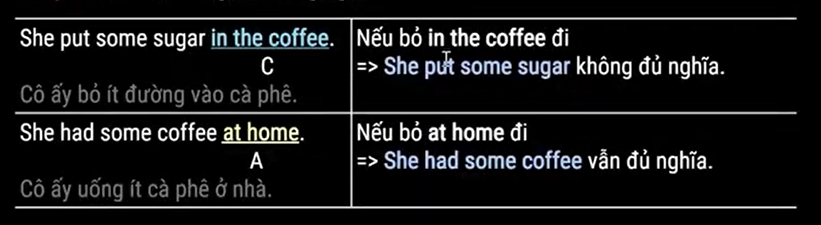
- Mệnh đề mệnh lệnh:
**Lưu ý 1:** Có cả khang định và phủ định
**Lưu ý 2:** Dùng Do not thay vì don't trong ngữ cảnh trang trọng
**Lưu ý 3:** Let's: Câu rủ câu gọi ý
- Mệnh đề cảm thán
What + a/an + adj + N + S + V
How + adj/adv + S + V

- Mệnh đề chính: Là tự nó là câu hoàn chỉnh, luôn được chia thì
- Mệnh đề phụ: là bản thân nó không phải câu hoàn chỉnh, có thể chia thì hoặc không
**Ví dụ**: I didn't go to work because I wasn't feeling very well

### 2.2 Câu 
Là một đơn vị ngữ pháp, được tạo nên bới một hoặc nhiều mệnh đề trong đó ít nhất một mệnh đề chính

Có 3 loại câu cơ bản
- Câu đơn: Có 1 mệnh đề là mệnh đề chính
- Câu ghép: là 2 mệnh đề chính với nhau với các liên từ
- Câu phức: 1 mệnh đề chính và  hoặc nhiều hơn mệnh đề phụ thuộc(liên từ phụ thuộc: because, if, after, although)
**Ví dụ:** I got up earlier than usual because I had to get the 6:30 

## Bài 3: Danh từ
### 3.1 Danh từ đếm được
- Chia làm 2 dạng là số ít và số nhiều
**Ví dụ:** She's got two sisters and a brother
=> Ta thường dùng cụm a pair of hoặc pairs of để nói về số lượng của những vật

### 3.2 Từ hạn định
Đứng trước danh từ và giới hạn số lượng của danh từ đó
trong danh từ thì từ hạn định + tính từ + danh từ

### 3.3 Mạo từ
an đứng trước âm đầu là nguyên âm
a đứng trước âm đầu là phụ âm
the dùng để nhắc lại danh từ đã nhắc đến từ trước, mạo từ đã được xác định
**Ví dụ:** Can you turn off the light, please?

## Bài 4: Đại từ
### 4.1 Đại từ nhân xưng
Ngôi	Chủ ngữ (làm S)	Tính từ sở hữu (đứng trước danh từ)	Tân ngữ (sau V, giới từ)	Đại từ sở hữu (thay thế tính từ sở hữu + danh từ)
Số ít				
1	I (tôi)	my	me	mine (của tôi)
2	you (bạn)	your	you	yours (của bạn)
3	he (anh ấy)	his	him	his (của anh ấy)
3	she (cô ấy)	her	her	hers (của cô ấy)
3	it (nó)	its	it	its (của nó)

Ngôi	Chủ ngữ (làm S)	Tính từ sở hữu (đứng trước danh từ)	Tân ngữ (sau V, giới từ)	Đại từ sở hữu (thay thế tính từ sở hữu + danh từ)
Số ít				
1	I (tôi)	my	me	mine (của tôi)
2	you (bạn)	your	you	yours (của bạn)
3	he (anh ấy)	his	him	his (của anh ấy)
3	she (cô ấy)	her	her	hers (của cô ấy)
3	it (nó)	its	it	its (của nó)
Số nhiều				
1	we (chúng tôi)	our	us	ours (của chúng tôi)
2	you (các bạn)	your	you	yours (của các bạn)
3	they (họ)	their	them	theirs (của họ)

### 4.2 Các từ cùng loại
> Đại từ làm chủ ngữ
  Ms. Jenny was not satisfied. **She** wants a refund.
  Mr. Lin and **I** will give the presentation. **We** are nervous.

> TÍnh từ sở hữu
  **My** computer is new.
  **Her** instruction manual is lost.

> Đại từ làm tân ngữ
  We ask **them** to fill in a form.
  She hasn't named **him** yet.

> Đại từ làm tân ngữ
  Our computer is faster, but **theirs** has more features.
  This manual is **mine**

### 4.3 Đại từ phản thân
a. Hình thức
Số ít	myself, yourself, himself, herself, itself
Số nhiều	ourselves, yourselves, themselves
b. Cách dùng
> Khi chủ ngữ và tân ngữ cùng là một
  I kept telling **myself** that nothing was wrong.
  The employees introduced **themselves** to the manager.

> Nhấn mạnh chủ ngữ hoặc tân ngữ
  She decorated the cake **herself**.
  The transaction number **itself** was entered incorrectly.

> Cụm giới từ và đại từ phản thân
  She was sitting **by herself**.
  He repaired his bike **by himself**.

### 4.4 Đại từ chỉ định
Gồm this, that, these, those
a. Cách cùng cơ bản
	Gần (khoảng cách)	Xa
Số ít	this (này)	that (kia)
Số nhiều	these (những cái này)	those (những cái kia)
**This** is the new calendar.
**Those** are our colleagues.
b. Dùng đại từ hạn định trước danh từ
**This** catalog is from last year.
**These** notes are hers.
c. Cách dùng đặc biệt
> Thay thế cho danh từ
  This year's distribution surpassed **that** of last year. (that = the distribution)
  Our products are better than **those** of our competitors. (those = the products)

> those who (= người mà)
  We invited those (who are) interested in our brand.

### 4.5 Đại từ bất định
a. Các đại từ kết thúc bằng -one, -body, -thing, -where
Kết hợp với every, any, some, no:
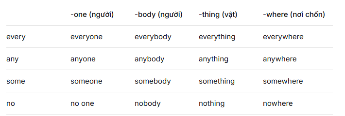
> Lưu ý: Các đại từ này luôn đi với động từ số ít.
  Everybody **makes** mistakes.
  Is **anyone helping** Claire?

Thêm tính từ/cụm từ phía sau:

Nothing **much**. (không có gì nhiều)

Are you thinking of anyone **in particular**?

b. Cấu trúc "some/most/any/all/few/little/both/either/neither + of + ..."
> Some/Most/Any + of + ...
  Công thức: some/most/any + of + the / these/those / my/your... + noun
  Hoặc: some/most/any + of + you/us/them
  Ví dụ:
  I wasn't sure about **some of the answers**.
  **Most of the information** was useful.
  Are **any of you** going?

> All + of + ...
  Có thể bỏ "of" trước danh từ có từ hạn định.
  **All (of) the workers** got a raise.
  I gave **all (of) my old books** to my sister.
  I need to speak to **all of you** .

> Few / A few / Little / A little + of + ...
  few / a few + of + danh từ đếm được số nhiều → động từ số nhiều
  little / a little + of + danh từ không đếm được → động từ số ít
  **A few of his films** were successful.
  Add **a little of the milk**.

> Both / Either / Neither + of + ...
  Dùng cho hai đối tượng.
  both of + động từ số nhiều
  either of + động từ số ít hoặc số nhiều (thường số ít)
  neither of + động từ số ít
  She looked at **both of us**.
  **Neither of my brothers lives** at home.
  I don't want **either of my parents** to know.

### 4.6 One, the other, another, others
Số lượng	Cách dùng
2	one → the other
3	one → another → the other
≥4	one → another (bất kỳ cái khác) → others (một vài cái khác) → the others (tất cả những cái còn lại)
Ví dụ:

2 sản phẩm: We will release **one** and then **the other**.

3 chuyến hàng: **One** is for America, **another** for Korea, and **the other** for Indonesia.

Nhiều hơn: **One** brand competes with **another**.
One trial finished, and **others** are ongoing.
Four workers: **One** cleans, **the others** rest.

## Bài 5: Tính từ
### 5.1 Phân loại tính từ
a. TÍnh từ có hậu tố
Nhiều tính từ được tạo bằng cách thêm hậu tố vào danh từ/ động từ hoặc tiền tố vào tính từ để mang nghĩa trái ngược
> Các hậu tố thường gặp
  able, -ible	comfortable, visible, reliable	thoải mái, có thể nhìn thấy, đáng tin cậy
  -al, -ial	normal, industrial, social	bình thường, thuộc công nghiệp, xã hội
  -ful	beautiful, harmful, peaceful	đẹp, có hại, yên bình
  -ic	classic, economic, fantastic	cổ điển, thuộc kinh tế, tuyệt vời
  -ive, -ative	active, creative, talkative	năng động, sáng tạo, nói nhiều
  -less	endless, priceless, timeless	bất tận, vô giá, vĩnh cửu
  -ous, -ious	dangerous, famous, anxious	nguy hiểm, nổi tiếng, lo lắng
  -y	angry, busy, wealthy, windy	giận, bận, giàu, có gió

> Các tiền tố thường gặp
  un-	unfair → unfair (không công bằng), unhappy (không vui)	
  in-	active → inactive (không hoạt động), complete → incomplete (không hoàn chỉnh)	
  im-	possible → impossible (không thể), polite → impolite (bất lịch sự)	
  ir-	responsible → irresponsible (vô trách nhiệm), regular → irregular (bất thường)	
  il-	legal → illegal (bất hợp pháp), logical → illogical (phi lý)	
  dis-	honest → dishonest (không trung thực)

### 5.2 Tính từ dạng phân từ(Ved, Ving)
Dạng	Ý nghĩa	Ví dụ
-ing	Diễn tả tính chất của sự vật/việc (chủ động, gây cảm xúc)	The movie is interesting. (Bộ phim thú vị)
-ed	Diễn tả cảm xúc của người (bị động, bị tác động)	I am interested in the movie. (Tôi thích bộ phim)

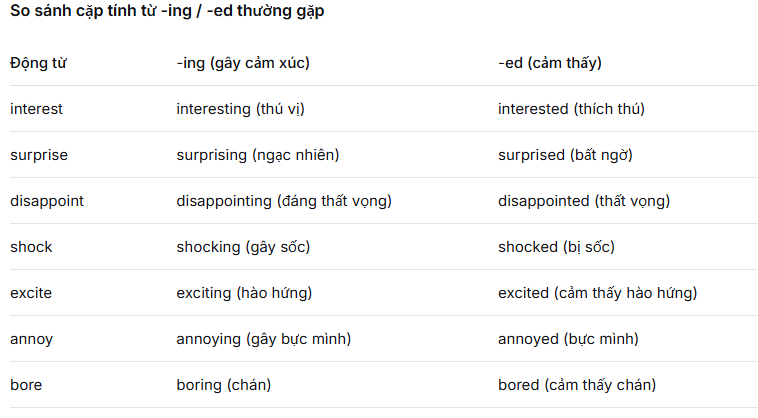
> Ví dụ:
  Julia thinks politics is **interesting**. (Chính trị thú vị)
  Julia is **interested** in politics. (Julia thích chính trị)
  The movie was **disappointing**. (Phim đáng thất vọng)
  We were **disappointed** with the movie. (Chúng tôi thất vọng về phim)

### 5.3 Tính từ ghép
Gồm 2 tính từ trở lên, nối với nhau bằng dấu gạch ngang
> Dạng phân từ ghép
  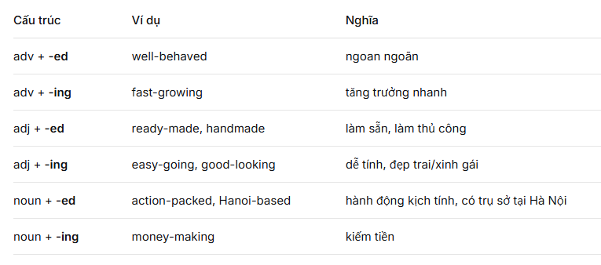

> Tính từ ghép khác
  short-term / long-term (ngắn hạn / dài hạn)
  small-scale (quy mô nhỏ)
  part-time (bán thời gian)

### 5.4 Chức năng chính của tính từ
a. Bổ nghĩa cho danh từ và đại từ bất định
> Tính từ bổ nghĩa cho danh từ
  The **high** price surprised him. (giá cao)
He lives in a **nice** house. (ngôi nhà đẹp)

> Nhiều tính từ cùng bổ nghĩa
  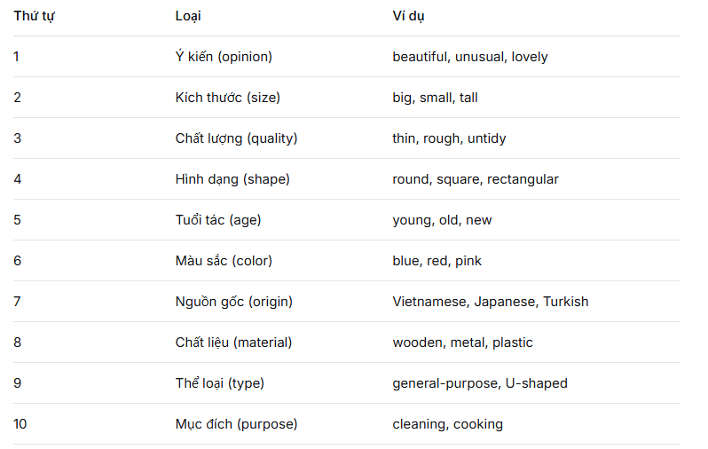

> Bổ nghĩa cho đại từ bất định
  Tính từ đứng sau đại từ bất định
  I want **something special** for my birthday. (điều gì đó đặc biệt)
  Is there **anyone new** here? (ai đó mới)

b. Đứng sau động từ nối
> Các động từ nối bao gồm
  Cảm giác: look, seem, taste, smell, sound, feel
  Biến đổi: become, grow, turn, make
  Duy trì: be, remain, keep, stay

> Các dùng tính từ với động từ nối
  Động từ nối + tính từ
  I am **tired** and I'm getting **hungry**. (mệt, đói)
  This tea tastes **strange**. (có vị lạ)
  Động từ nối + tân ngữ + tính từ
  Các động từ như find, make:
  I find living in the city **stressful**. (cảm thấy sống ở thành phố căng thẳng)
  He made me **angry**. (làm tôi tức giận)

### 5.5 Vị trí của tính từ
> Tính từ đứng sau động từ nối( không đứng trước tính từ)
  Tính từ đứng trước danh từ( không đứng sau tính từ nối)

> Một số cấu trúc quan trọng
  so + adj + that
  such + (a/ an) + adj + N + that
  adj + enough + to V
  too + adj + to V

## Bài 6: Thì
### 6.1 Thì hiện tại đơn
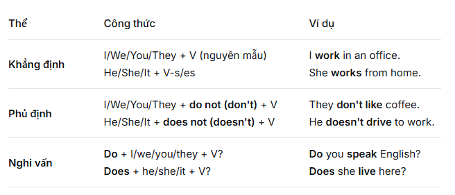
Với động từ "to be":

Khẳng định: I am; He/She/It is; We/You/They are

Phủ định: thêm not

Nghi vấn: đưa am/is/are lên đầu câu

Cách dùng chính
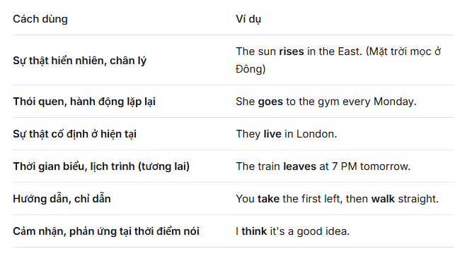
Dấu hiệu nhận biết: trạng từ chỉ tần suất: always, often, sometimes, rarely, never, every, ...
### 6.2 Thì hiện tại tiếp diễn
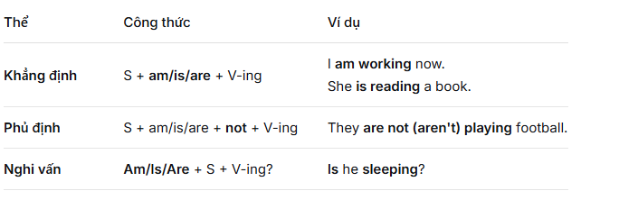
Cách dùng: Hoạt động đang xảy ra tại thời điểm nói, trạng thái tạm thời, hành động gây khó chiêu, sự thay đổi dần dần, kế hoặc của tương lại( đã sắp xếp)

Dấu hiệu nhận biết
now, right now, at the moment, at present, this week/month, today, nowadays
> Lưu ý: Động từ không dùng ở thì tiếp diễn
  Chỉ suy nghĩ: know, think (that), understand, believe
Chỉ cảm xúc: love, hate, like, want, need
Chỉ giác quan: see, hear, smell, taste, feel
Chỉ sở hữu: have (có), belong, own
Chỉ tồn tại: be (khi chỉ trạng thái chung), consist, contain

### 6.3 Thì hiện tại hoàn thành
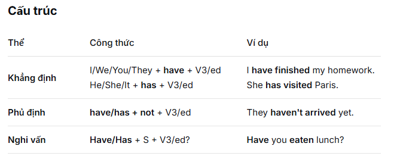
Cách dùng chính
Không rõ thời gian, hành đỘng vừa xảy ra, hành động bắt đầu trong quá khứ, đến hiện tại và có thể kéo dài tới tương lai
Dấu hiệu nhận biết: ever, never, already, yet, just, recently, lately, so far, up to now, for + khoảng thời gian, since + mốc thời gian

> Phân biệt
  Hiện tại hoàn thành: không có thời gian cụ thể
  Quá khứ đơn: có thời gian cụ thể

### 6.4 Thì hiện tại hoàn thành tiếp diễn
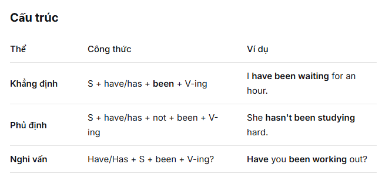
Cách dùng chính: Hoạt đỘng bắt đầu từ quá khứ và kéo dài đến hiện tại, còn kết quả ở hiện tại, liên tục từ quá khứ đến hiện tại

> So sánh với hiệN tại hoàn thành thì hoàn thành tiếp diễn nhấn mạnh quá trình/ sự kéo dài còn hiện tại hoàn thành quan trọng kết quả và sự hoàn thành

### 6.5 Quá khứ đơn
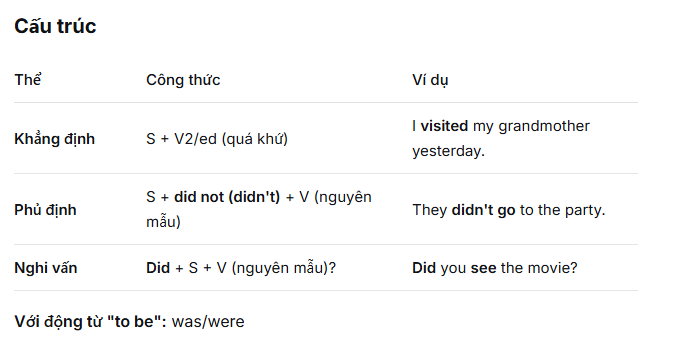
Cách dùng chính
Hành động đã kết thức tại một thời điểm xác định trong quá khứ, kể lại chuỗi hoạt động trong quá khứ, thói quan đã có trong quá khứ (không còn ở hiện tại)

### 6.6 Quá khứ tiếp diễn
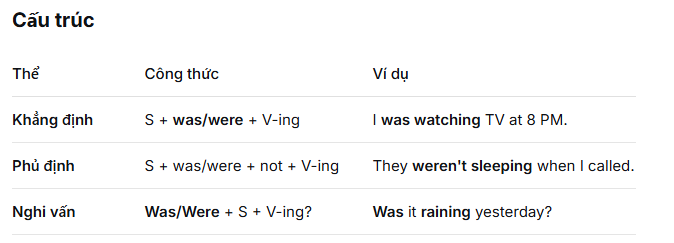
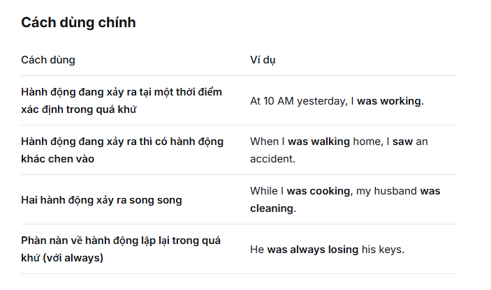

### 6.7 Quá khứ hoàn thành
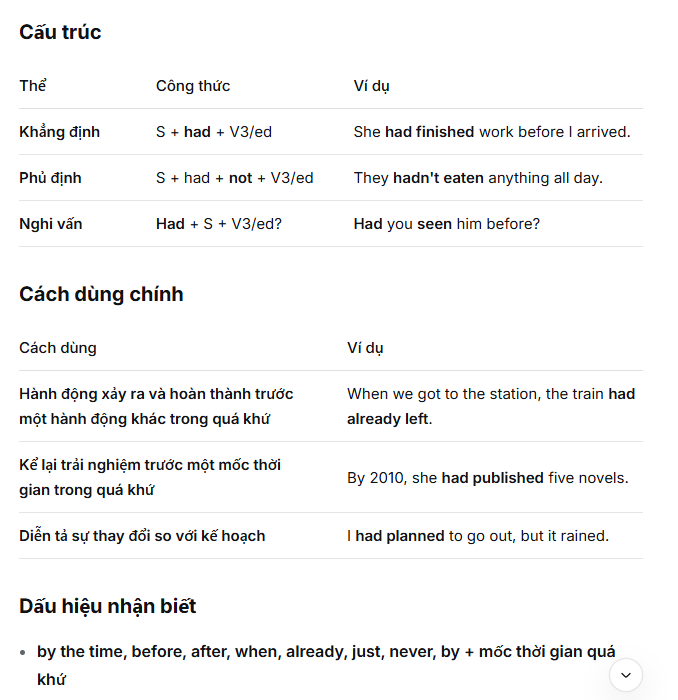
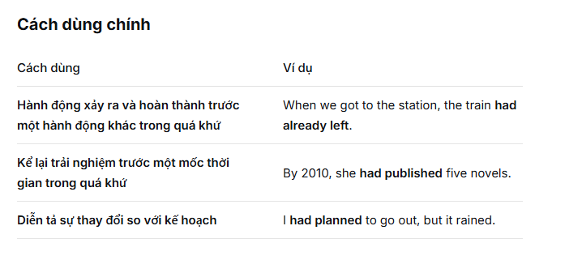

### 6.8 Quá khứ hoàn thành tiếp diễn
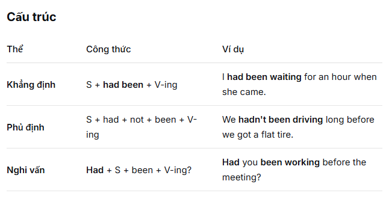
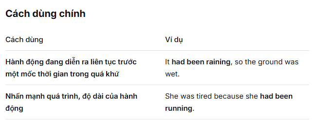
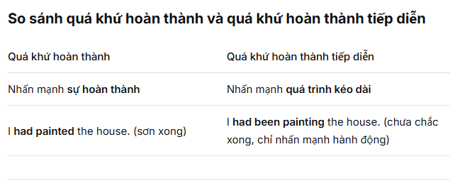
### 6.9 Tương lai đơn
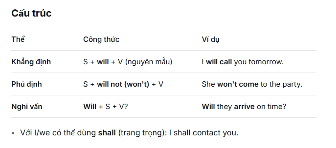
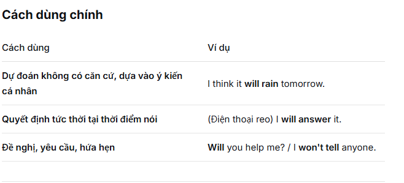

### 6.10 Tương lai gần
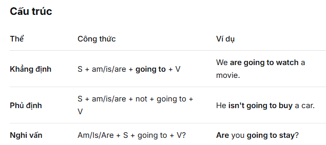
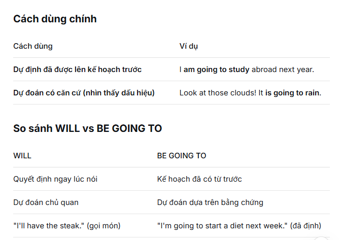
### 6.11 Tương lai tiếp diễn
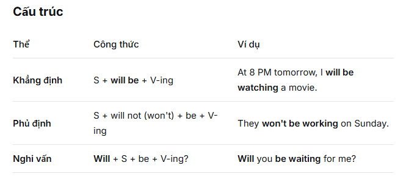
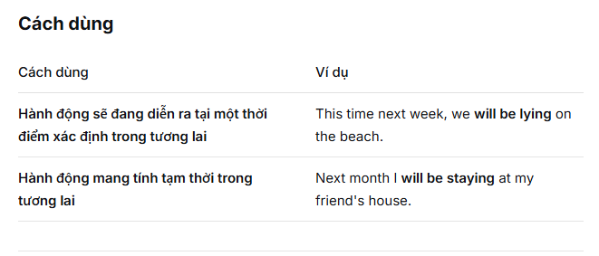

### 6.12 Tương lai hoàn thành và tương lai hoàn thành tiếp diễn
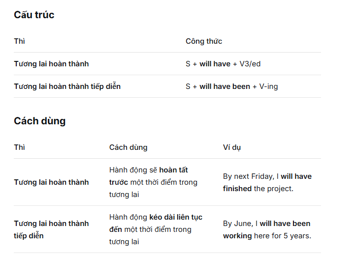
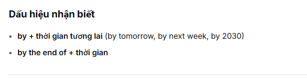

### 6.13 Tóm tắt tất cả các thì
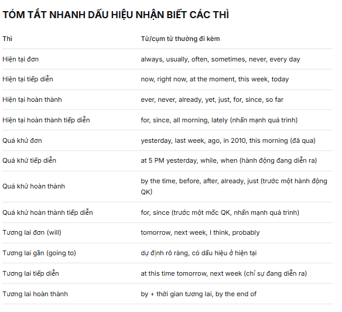

## Bài 7: Thể bị động
### 7.1 Khái niệm
Thể bị động được dùng khi chủ ngữ là đối tượng chịu tác động của hành động, thay vì thực hiện hành động đó
> Cấu trúc chung: be + V3/ed(VPII)
  Trong đó: 
  Be chia theo thì, chủ ngữ và cấu trúc câu
  VPII quá khứ phân từ luôn giữ nguyên

> So sánh chủ động và bị động
  Chủ động: My father designed these houses in 2000
  Bị động: These house were designed in 2000 by my father

### 7.2 Cách chia thể bị động theo thì
> Các thì hiện tại và quá khứ
  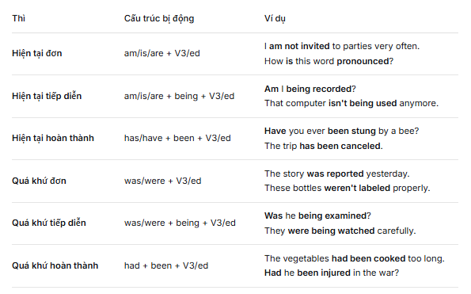

> Các thì tương lai và động từ khuyết thiếu
  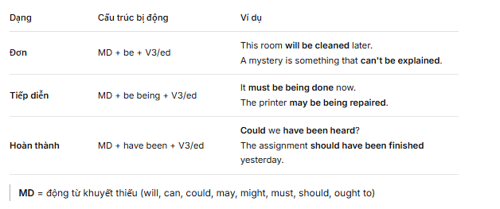

### 7.3 Một số cấu trúc bị động đặc biệt
> Bị động với V-ing( dùng sau một số động từ như like, hate, remember, without,...)
  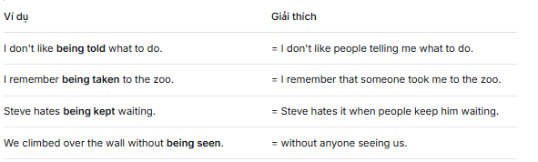

> Bị động với get
  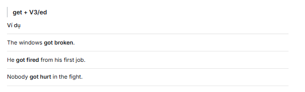

> Cấu trúc have something done/ get something done
  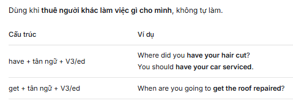

> Cấu trúc tường thuật
  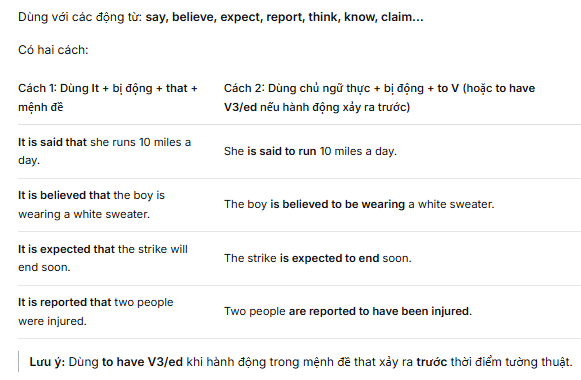

### 7.4 Các lưu ý quan trọng
> Tác nhân(by + agent) - có thể bỏ qua
  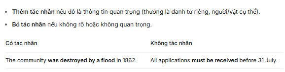

> Dùng giới từ khác thay by khi nói về công cụ, nguyên liệu
  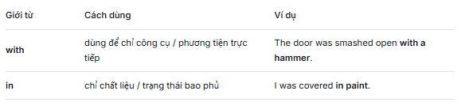

> Câu chủ động có 2 tân ngữ - 2 cách chuyển bị động
  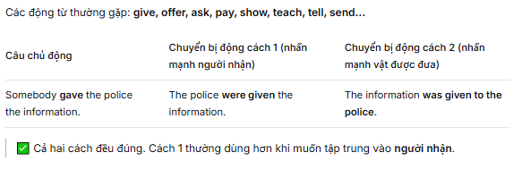

### 7.4 Tóm tắt
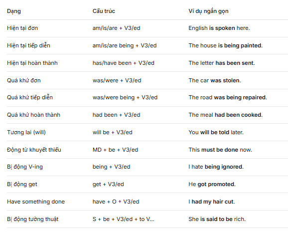

## Bài 8: Động từ nguyên mẫu và động từ khởi phát
### 8.1 Động từ nguyên mẫu
Là động từ không thay đổi và ở dạng nguyên thể
### 8.2 Các trường hợp dùng động từ nguyên mẫu
> Sau động từ khiếm khuyết
  Can/could/may/might/will/shall/would/should/ought to/ must + V-inf
  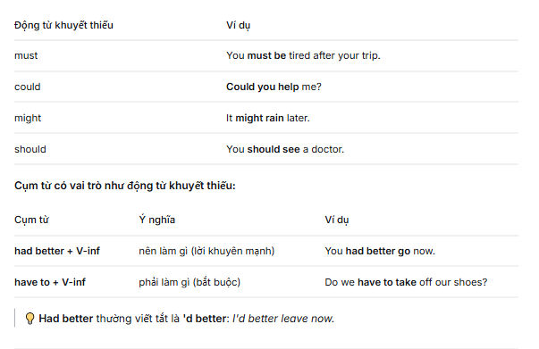

> Sau động từ khởi phát
  Let + O + V-inf
  make + O + V-inf
  have + O + V-inf
  help + O + (to) + V-inf

> Động từ tri giác + O + V-inf
  Các động từ tri giác: see, hear, feel, watch, notice + O + V-inf
  Ví dụ: We saw her get off the bus
  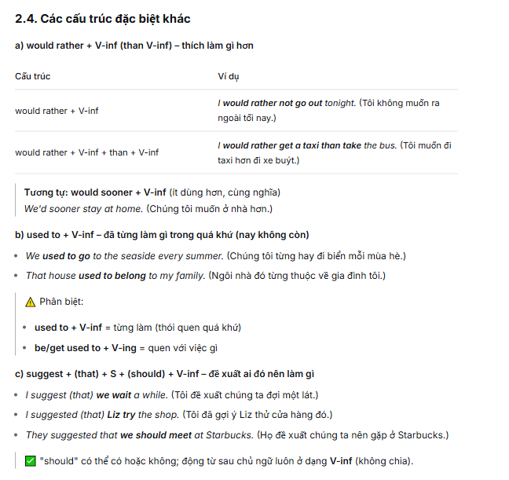

### 8.3 Tóm tắt
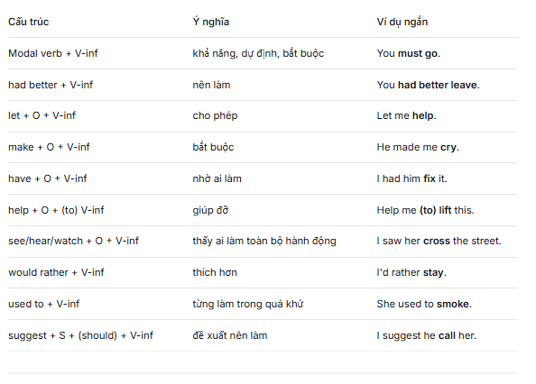

